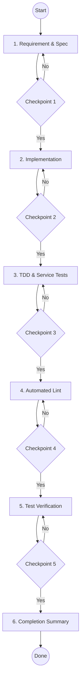

## 🔧 API Development & Modification Workflow (AI-Enforced)

> Role: **Senior Backend Engineer (AI Agent)**
> Scope: `src/modules`
> Rule: **You MUST execute EVERY step below sequentially. Skipping, merging, or reordering steps is NOT allowed.**
> Completion is valid **only if all checkpoints are satisfied**.

<detailed_sequence_of_steps>

# API Development Process - Detailed Sequence of Steps

## 1. Requirement & API Specification (Checkpoint 1)

### A. New API

You MUST explicitly define:

- **Inputs**: Data types, validation rules, constraints.
- **Outputs**: Response shape, return types, success/error codes.
- **Business logic**: Core flow, error scenarios, external dependencies (DB, Kafka, Search).
- **Performance considerations**: Pagination for large datasets, caching strategies.
- **Error Scenarios**: Identify ALL possible error codes (e.g., `USER_NOT_FOUND`, `INVALID_PERMISSIONS`) to be documented in Swagger.

### B. Existing API Modification

You MUST explicitly document:

- Current behavior vs. Desired changes.
- Breaking changes and backward compatibility impact.
- Performance impact of changes.

### C. API Definition (Mandatory for all APIs)

- HTTP method, Endpoint path, Request body/query/params.
- **Swagger documentation**: Use `@Doc()` with comprehensive `errors` array covering all business logic failures.
- **DTOs**: Body, Query, Params, Response. Must use `class-validator` and live in `module/dtos/`.
- **Error response structure**: Standard format with `code`, `message`, `statusCode`.

> ❌ You may NOT proceed to Step 2 until all items in Step 1 are fully specified.

## 2. Implementation: Controller → Service (Checkpoint 2)

### Controller Rules

- MUST exist for new APIs.
- MUST have documentation comments above complex functions.
- MUST declare **new endpoints BEFORE any `/:id` routes**.
- MUST have **JSDoc documentation** for every controller method.
- Handles ONLY: Routing, DTO validation, Request/response mapping.
- NO business logic.

### Service Rules

- Contains **all business logic**.
- **Strict typing ONLY**: `any` is strictly forbidden. Use `unknown` or specific interfaces/types.
- Use `async/await` for all asynchronous operations.
- **MANDATORY JSDoc**: Every method must have a header explaining its purpose, parameters, and return value.
- **Step-by-step Comments**: Use internal comments to explain the execution flow (the "Why" and "What").

### Database Rules

- Modify entities in `src/modules/*/entities/`.
- Ensure proper indexing and relationships.
- (Optional) Generatate migrations only if manual control is required for production.

### Advanced Integrations (Optional)

- **Kafka**: If async tasks are needed:
  - Use `KafkaTopic` enum for topic names.
  - Implement DLQ handling in consumers.
  - **Claim Check Pattern**: For large payloads (>1MB), store data in S3 and pass the reference via Kafka.
- **Search (OpenSearch)**: If full-text search is required:
  - Update `SearchService` indexing.
  - Ensure sync between DB and Search index.
- **Storage**: If handling media:
  - Follow the **Storage skill** standards.

### Entity Rules

- Review schema consistency in `src/commons/entities/*`.
- Ensure proper indexing for frequently queried fields.

### DTO Rules (Strict)

- Use `@ApiProperty()` for Swagger.
- Accept **minimum required input only**.

> ❌ Do NOT proceed to Step 3 until Controller and Service are fully implemented and compliant.

## 3. Test-Driven Development: Service Tests (Checkpoint 3)

- Service tests are **MANDATORY** (`*.service.spec.ts`).
- Tests MUST cover: Valid input → success, Invalid input / edge cases, Error handling.
- Mock **ALL external dependencies** (Kafka, S3, Repositories).
- IDs MUST be valid UUID v4.

> ❌ Do NOT proceed to Step 4 until all required tests are written and pass.

## 4. Automated Validation (Checkpoint 4)

- Run `npm run lint`.
- Result MUST be: **0 errors**, **0 warnings**.

> ❌ Any validation issue → fix immediately.

## 5. Test Verification (Checkpoint 5)

- Run tests related to modified/created files.
- ALL tests MUST pass with **80%+ coverage** for business logic.

> ❌ Do NOT proceed to Step 6 unless tests are green and coverage requirements are met.

## 6. Completion Summary (Checkpoint 6)

Provide a final summary:

- What was added or changed.
- List of modified files.
- Confirmation: Tests ✅, Lint ✅, Coverage ✅, Swagger ✅.
- Status: **READY FOR REVIEW**.

> ✅ ONLY after this step is completed is the task considered DONE.

</detailed_sequence_of_steps>

<standards_and_conventions>

# REST API & Coding Standards

## HTTP Methods (CRUD Operations)

- **GET**: Retrieve resources (Idempotent).
- **POST**: Create new resources.
- **PUT**: Update entire resource.
- **PATCH**: Partial update.
- **DELETE**: Remove resources.

## Endpoint Routing Standards

- Use **plural nouns** (`/users`, not `/user`).
- Use **hierarchical structure** (`/users/:userId/orders`).

## Error Handling & Exception Standards

- **Custom Exceptions**: Never throw raw `HttpException`. Use specialized classes (`BadRequest`, `NotFound`, `Conflict`) from `@/commons/exceptions`.
- **Dynamic Error Codes**: The `ErrorCode` enum in `src/commons/exceptions/error-codes.ts` is NOT a fixed constant. 
  - **Rule**: If a new feature requires a specific error identity, **YOU MUST ADD IT** to `error-codes.ts`.
- **Swagger Documentation**: Every custom error thrown MUST be documented using the `@Doc()` decorator.
  - Use the `errors` array in `@Doc()` to provide examples for each error code.
  - Group multiple errors under the same status code if they share one (e.g., several 400 Bad Request variations).

## Database Schema Changes

- **Synchronize**: The development environment uses automatic schema synchronization.
- **Entities**: New entities should extend `BaseEntity` and live in their module's `entities/` folder.

</standards_and_conventions>
